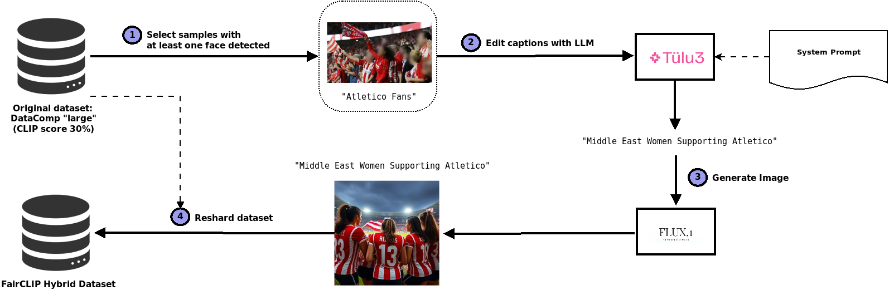

FairCLIP data pipeline:




1) filter all samples with at least 1 face detected.
2) filter samples with English caption and process captions with an LLM to produce t2i prompts. 
3) generate images with prompts from step 3 and modify the txt and json files accordingly.
4) reshard all .tar shards files using the generated images and modified txt and json files.

-----------------------


## 1) filter all samples with at least 1 face detected 
script `01_filter_noface.sh` calls 01_filter_noface.py for each .tar file in `SRC_DIR="/gpfs/scratch/ehpc42/datasets/datacomp/large_filtered/shards"` a json file will be created in `TARGET_DIR="/gpfs/scratch/ehpc42/datasets/datacomp/large_hybrid/captions"` 


script `01_filter_noface.py` reads the tar file and creates a json file per shard (e.g. json file prompts/00000000.json correspond to captions in 00000000.tar shard) in `/gpfs/scratch/ehpc42/datasets/datacomp/small_hybrid/captions`, each file has a dictionary with filenames as keys and captions as values:

```
{
    "000d6d31d370fcf64fcb4ce869c5ed96-0.json": "Jos Chessani medalla oro tokio 2020",
    "0041c043f693222ade350169e6a4a663-0.json": "granizosaude1",
    "0098ebd8027f13d12fb3d730f56bdafe-0.json": "HISENSE - Smart TV UHD 4K 65'' Vidaa Dolby Vision 65A6H",
...
}
```

also stores the json files of selected samples in /gpfs/scratch/ehpc42/datasets/datacomp/large_hybrid/edits

## 2) filter samples with English caption and process captions with an LLM to produce t2i prompts.
script `02_captions_processor.py` read json files from `/gpfs/scratch/ehpc42/datasets/datacomp/small_hybrid/captions` and creates files with same format in `/gpfs/scratch/ehpc42/datasets/datacomp/small_hybrid/prompts`. This files (one per shard) sonatain the modified captions that will be used to generate images in next step.

the script `02_captions_processor.py' assumes you have several ollama instances serving in different ports. you can configure the ollama ports and model via arguments:

* --input "Path to folder with shard tar files."
* --output "Path to output folder where JSON files with results will be saved."
* --num_threads "Number of concurrent threads." (default=20)
* --ports "Comma-separated list of ports for ollama instances." (default="11434,11435,11436,11437")
* --model_name "Name of the ollama model." (default="tulu3:fairclip")
* --timeout type=int, "Timeout for each request in seconds." (default=10)

Calling the script:

```bash
python3 02_captions_processor.py --input /path/to/captions/ --output /path/to/prompts
```

generates a json file for each shard (e.g. json file prompts/00000000.json correspond to captions in 00000000.tar shard). Each json file is a dictionary with caption ID as key and the processed caption as value.

## 3) generate images with prompts from previous step
slurm script `03_generate_images.sh` launches a SLURM srun command that calls python script `03_generate_images_multigpu.py`. It generates images using prompts from `/gpfs/scratch/ehpc42/datasets/datacomp/large_hybrid/prompts` and saves generated images and edited json/txt files into directory `/gpfs/scratch/ehpc42/datasets/datacomp/large_hybrid/edits`


## 4) rebuild shards with generated data
script `04_reshard.sh` calls python `04_reshard.py` to create tar files faster by using sequential readings from the original tar files in `/gpfs/scratch/ehpc42/datasets/datacomp/large_filtered/shards`, updating edited samples from `/gpfs/scratch/ehpc42/datasets/datacomp/large_hybrid/edits`. This produces a new set of shards with the hybrid dataset in `/gpfs/scratch/ehpc42/datasets/datacomp/large_hybrid/shards`
